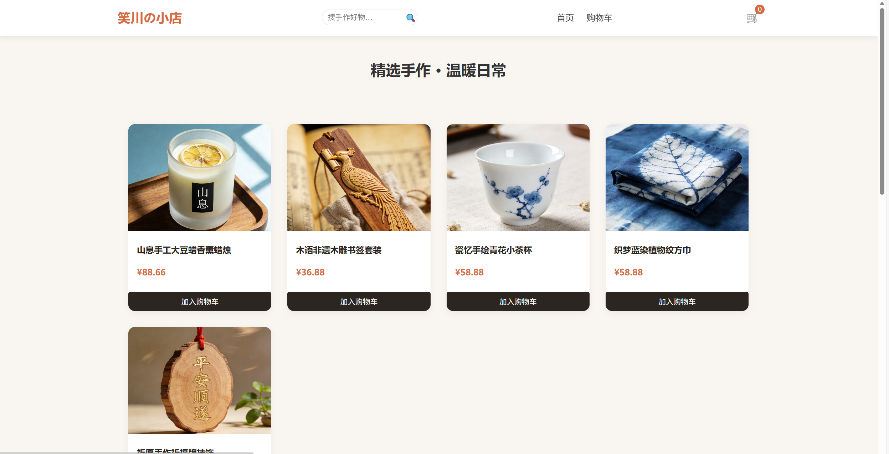

[README.md](https://github.com/user-attachments/files/24431993/README.md)
# 笑川の小店 · 手作温度

> 一个温暖的手工制品线上展示与购物网站  
> 精选五款匠心手作物：香薰蜡烛、木雕书签、青花茶杯、蓝染方巾、祈福挂饰

 <!-- 可选：添加截图后启用 -->

---

## 🌟 项目简介

“笑川の小店”是一个**纯前端静态电商网站**，无需后端，完全基于 HTML、CSS 和 JavaScript 构建。  
适用于手工艺人、独立设计师或小型文创品牌快速搭建线上展示窗口，并通过微信/QQ 完成交易。

- ✅ 商品浏览与多规格选择（如香味、图案）
- ✅ 购物车功能（本地存储，全站同步）
- ✅ 模拟结算流程（引导联系客服付款）
- ✅ 响应式设计（适配手机与电脑）
- ✅ 客户评价模块 + 完整页脚信息

---

## 🛒 功能亮点

| 功能 | 说明 |
|------|------|
| **商品详情页** | 每款商品支持变体选择（如蜡烛香味、茶杯图案） |
| **购物车系统** | 使用 `localStorage` 实现跨页面同步，支持增删改 |
| **结算引导** | 跳转至 `checkout.html`，提示“付款请联系 23120170” |
| **客户评价** | 首页展示真实感评论，增强信任 |
| **统一页脚** | 全站一致的客服、指南、版权信息 |

---

## 📁 项目结构
